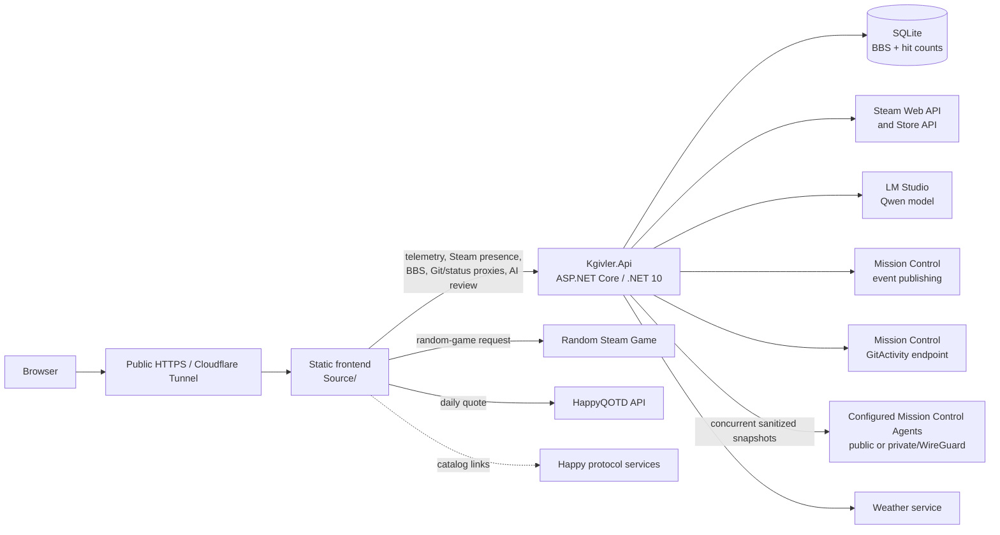

# kgivler.com // systems architecture manual

Repository for [www.kgivler.com](https://www.kgivler.com/), Kyle Givler's terminal-themed portfolio and public systems lab.

## Purpose

This project is both a portfolio and an operating display for software that is actually deployed. The static frontend presents project case studies, a service catalog, and a fake-shell interface. Its optional live widgets connect to a small ASP.NET Core API and related self-hosted services for workstation telemetry, Steam presence, Git activity, quotes, BBS messages, service health, and local-AI code review.

The terminal presentation is intentional, but the site is not only a novelty shell. Conventional navigation, semantic page structure, accessible controls, and independently degrading widgets keep the portfolio useful when JavaScript or a self-hosted dependency is unavailable.

## Screenshots

No current UI screenshots are tracked in this repository. Use the [live site](https://www.kgivler.com/) for the current interface.

## Features

- Professional portfolio, flagship project case studies, and additional project catalog.
- Live workstation CPU, memory, storage, GPU, uptime, weather, and request telemetry.
- Public Steam presence and a Random Steam Game interactive demo.
- Service catalog with static architecture details and selectable live Mission Control node snapshots.
- Quote of the Day widget backed by HappyQOTD.
- Public chat link and a small SQLite-backed visitor BBS.
- Recent Git activity projected through Mission Control and proxied by `Kgivler.Api`.
- Best-effort local code review backed by Qwen through LM Studio.
- Fake-shell commands for discovery, telemetry, project information, and BBS access.
- Responsive terminal styling, reduced-motion support, keyboard focus states, and per-widget failure handling.

## Architecture

### Frontend

`Source/` is a framework-free static site:

- HTML provides the homepage, Services page, metadata, and no-JavaScript content.
- CSS preserves the terminal-window identity and responsive layout.
- Native JavaScript modules implement commands, API access, polling, timeouts, safe rendering, and widget state.
- Bootstrap and Font Awesome stylesheets are version-pinned CDN dependencies with Subresource Integrity metadata.

The homepage loads `Source/js/main.js` as an ES module. API access is centralized in `Source/js/api.js`; the Services page has a separate `Source/Services/services.js` controller for filtering and live snapshot rendering.

### Backend

`Kgivler.Api` is an ASP.NET Core Minimal API targeting .NET 10. It provides:

- Minimal API routes for telemetry, Steam presence, Git activity, service status, code review, and the BBS.
- SQLite storage for BBS messages and site hit counts.
- Fixed-window rate-limiting policies for BBS writes, telemetry/Git activity, Steam, and code review.
- Named `HttpClient` instances with bounded timeouts for Steam, LM Studio, Git activity, Mission Control Agents, and weather.
- Concurrent, failure-isolated Agent snapshot proxying with a short in-memory cache and a sanitized public projection.
- Steam Web API integration with short-lived in-memory caching.
- Mission Control event publishing for selected site, BBS, Steam, and code-review activity.
- A Qwen review adapter for an OpenAI-compatible LM Studio server.
- Windows/Linux host telemetry with optional `wmic` and `nvidia-smi` enrichment when those tools are available.

### Related systems

- [Random Steam Game](https://randomsteam.kgivler.com/) owns the random-game application and API.
- The Mission Control ecosystem receives integration events; its GitActivity endpoint and per-node Agent APIs supply activity and operational snapshots to `Kgivler.Api`.
- HappyEcho, HappyDiscard, HappyDaytime, HappyQOTD, HappyFinger, HappyGopher, and HappyGemini are related public protocol projects listed in the service catalog.
- HappyQOTD supplies the homepage quote directly through its public HTTP API.
- Public HTTPS traffic reaches selected self-hosted components through Cloudflare tunnels; tunnel configuration is not stored in this repository.



The diagram shows logical request paths. Random Steam Game and HappyQOTD are called directly by the frontend. Service status follows `Browser -> Kgivler.Api on the workstation/IIS -> configured Mission Control Agent fleet`. Agents may be reachable only through private networking such as WireGuard; their addresses and credentials are never sent to the browser.

## Repository structure

```text
kgivler_com/
├── Source/                         Static website root
│   ├── index.html                  Homepage and live systems lab
│   ├── styles.css                  Shared terminal styling
│   ├── js/                         Browser ES modules and command system
│   ├── Services/                   Service catalog and live status view
│   ├── robots.txt                  Crawler policy
│   ├── sitemap.xml                 Public page index
│   └── web.config                  IIS static MIME, rewrite, and error setup
├── Kgivler.Api/
│   ├── Program.cs                  Service registration and route mapping
│   ├── Routes/                     Minimal API route groups
│   ├── CodeReview/                 LM Studio/Qwen integration
│   ├── Steam/                      Steam presence integration
│   ├── ServicesStatus/             Sanitized Agent fleet transport models
│   ├── Telemetry/                  Site telemetry event models
│   ├── Bbs/                        BBS models and event payloads
│   ├── Extensions/                 CORS and middleware configuration
│   └── Kgivler.Api.slnx            .NET solution
├── LICENSE.md
└── README.md
```

The public `Source/config.*`, `.env`, WordPress-lookalike, and dot-git-lookalike files are intentional scanner bait. They are not application configuration and contain no valid runtime credentials.

## Local development

### Prerequisites

- .NET 10 SDK.
- A static-file server for `Source/`.
- Optional: Steam API credentials, LM Studio, Mission Control, Random Steam Game, and HappyQOTD for their corresponding integrations.

### Restore, build, and test

From the repository root:

```powershell
dotnet restore Kgivler.Api/Kgivler.Api.slnx
dotnet build Kgivler.Api/Kgivler.Api.slnx
dotnet test Kgivler.Api/Kgivler.Api.slnx --no-build
```

The solution currently contains the API project and no automated test project, so `dotnet test` validates the solution target but does not execute test cases.

### Run the API

```powershell
dotnet run --project Kgivler.Api/Kgivler.Api.csproj --launch-profile http
```

The checked-in launch profile listens on `http://localhost:5081` with the Development environment enabled.

### Serve the frontend

`Kgivler.Api` does not call `UseStaticFiles`; it does not serve `Source/`. Run a separate static server. For example, with Python installed:

```powershell
python -m http.server 5500 --directory Source
```

Then open `http://localhost:5500/`. Development CORS permits the checked-in local origins on ports 5500 and 3000.

`Source/js/config.js` switches API targets when the hostname is `localhost` or `127.0.0.1`:

- `Kgivler.Api`: `http://localhost:5081`
- Random Steam Game: `http://localhost:5182`
- HappyQOTD: `http://localhost:5269`

The portfolio and independently available widgets remain usable when the optional companion services are not running.

## Configuration

Use .NET user secrets for local development and environment variables or protected deployment configuration in production. Never commit real API keys, access-client secrets, or bearer tokens.

| Section | Keys | Purpose |
| --- | --- | --- |
| `Steam` | `ApiKey`, `OwnerSteamId`, `CacheSeconds` | Steam presence lookup and cache duration |
| `LmStudio` | `BaseUrl`, `Model` | OpenAI-compatible local inference endpoint and Qwen model ID |
| `GitActivity` | `BaseUrl`, `ApiKey` | Upstream Mission Control Git activity API |
| `MissionControl` | `Enabled`, `BaseUrl`, `ApiKey`, `CloudflareAccessClientId`, `CloudflareAccessClientSecret`, `TimeoutMilliseconds` | Event publishing and private service access |
| `ServicesStatus` | `TimeoutSeconds`, `CacheSeconds`, `Hosts` (`NodeId`, `DisplayName`, `BaseUrl`) | Sanitized multi-host Mission Control Agent snapshot proxy |
| `Logging` | standard ASP.NET Core logging keys | Runtime logging levels |
| root | `AllowedHosts` | ASP.NET Core host filtering |

Example user-secret commands with placeholder values:

```powershell
dotnet user-secrets set "Steam:ApiKey" "<steam-web-api-key>" --project Kgivler.Api/Kgivler.Api.csproj
dotnet user-secrets set "GitActivity:ApiKey" "<mission-control-api-key>" --project Kgivler.Api/Kgivler.Api.csproj
dotnet user-secrets set "MissionControl:ApiKey" "<mission-control-api-key>" --project Kgivler.Api/Kgivler.Api.csproj
```

Equivalent environment variables use ASP.NET Core's double-underscore convention, such as `Steam__ApiKey`, `LmStudio__BaseUrl`, and `MissionControl__Enabled`.

The checked-in `ServicesStatus` configuration contains only Clanker's existing public Agent URL. On the Windows workstation that runs `Kgivler.Api` under IIS, add private nodes through protected IIS environment configuration (or another private ASP.NET Core configuration provider). For example, replace the placeholder URLs below with Agent base URLs reachable from that workstation; do not include `/api/snapshot`:

```text
ServicesStatus__Hosts__0__NodeId=clanker
ServicesStatus__Hosts__0__DisplayName=Clanker
ServicesStatus__Hosts__0__BaseUrl=https://status-api.kgivler.com/

ServicesStatus__Hosts__1__NodeId=scopecreep
ServicesStatus__Hosts__1__DisplayName=ScopeCreep
ServicesStatus__Hosts__1__BaseUrl=<private-scopecreep-agent-base-url>

ServicesStatus__Hosts__2__NodeId=molasses
ServicesStatus__Hosts__2__DisplayName=Molasses
ServicesStatus__Hosts__2__BaseUrl=<private-molasses-agent-base-url>
```

Indexes must be contiguous. Omit future nodes until they exist. `ServicesStatus__TimeoutSeconds` and `ServicesStatus__CacheSeconds` may override the bounded request timeout and short response cache. Never put private/WireGuard Agent URLs in `appsettings.json` or frontend files.

`GET /api/services/hosts` returns `{ generatedAt, hosts }`. Every host includes its configured `nodeId`, `displayName`, `available`, and sanitized `status`; an available host also includes `snapshot` with capture age/freshness, publication state, host metrics, Docker availability, containers, and protocol probe results. A failed host instead carries a generic `message`. Agent base URLs, protocol endpoints/errors, credentials, and raw exceptions are not part of the response.

Some integrations deliberately have no useful local fallback without private configuration. Missing configuration should produce an unavailable state for that widget rather than prevent the rest of the site from loading.

## Deployment overview

The frontend and API are deployed separately:

1. Deploy the contents of `Source/` to the static web root. The checked-in `web.config` supplies IIS MIME mappings, rewrites, and custom error handling.
2. Publish the API as a framework-dependent .NET 10 application:

   ```powershell
   dotnet publish Kgivler.Api/Kgivler.Api.csproj -c Release
   ```

3. Supply production secrets and private Agent host configuration outside the repository, and ensure the API process can write its SQLite database in the application working directory.
4. Route only the intended public hostnames through the external Cloudflare tunnel configuration.

The repository includes a filesystem publish profile for the API but no complete CI/CD pipeline, tunnel configuration, service manager configuration, or infrastructure-as-code definition. Those deployment details are environment-specific.

## Security and privacy notes

- Production CORS is limited to `https://kgivler.com` and `https://www.kgivler.com`; local origins are added only in Development.
- Public API routes preserve fixed-window rate limits appropriate to their workloads.
- BBS database writes use SQL parameters, and browser rendering escapes visitor content.
- Steam, Git activity, quote, telemetry, and AI output are validated or escaped before browser rendering; trusted HTML helpers are reserved for controlled templates.
- Private Mission Control and Git activity keys stay on the server. Agent URLs (including WireGuard addresses), credentials, and raw upstream diagnostics stay on the workstation; the browser receives only the sanitized multi-host projection.
- The telemetry endpoint intentionally exposes selected host/runtime metrics and reads the connecting address for hit counting. Do not add sensitive host, process, filesystem, or network details to that payload.
- The local AI review is an experiment, not a security scanner or formal audit. Submitted code is sent to the configured LM Studio endpoint.
- Administrative tools may be described in the service catalog, but authenticated dashboards and loopback-only endpoints are not presented as public controls.
- Scanner-bait files under `Source/` contain fictional values. Do not repurpose them for real configuration.

## Known limitations

- Self-hosted widgets can be unavailable during workstation maintenance, tunnel interruption, model shutdown, or VPS/service outages.
- A local frontend run is only fully interactive when its optional companion services and private configuration are also available.
- Some telemetry fields depend on operating-system facilities, `wmic`, or `nvidia-smi`; missing tools produce partial metrics rather than startup failure.
- The service catalog is curated static content with node-aware observation mappings, while the Docker/protocol table is the selected node's live snapshot. They can temporarily differ during deployments.
- The repository currently has no automated test project or committed browser-test suite.
- Current UI screenshots are not tracked in the repository.

## License

Copyright (c) 2026 Kyle Givler.

Licensed under the MIT License. See [LICENSE.md](LICENSE.md).
